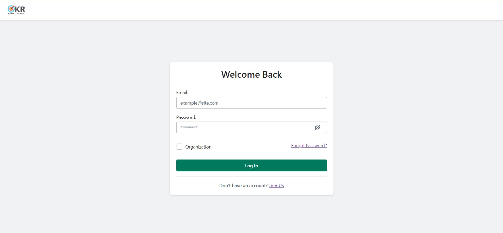

# okr-frontend

## Login Component Documentation
The Login component is a form-based component that allows users to log in to an application. It provides a user interface for entering email and password credentials, as well as an option for selecting organization login and a link for password recovery. The component is built using the React framework and utilizes various dependencies and custom components.

### Props
The Login component does not accept any props. However, it relies on the LoginLayout component for rendering the overall layout and handling form submission.

### State
The Login component maintains the following states:

formData: An object that stores the form data, including email, password, and isOrganization (a boolean indicating whether the login is for an organization).
error: An object that stores error messages related to form validation.
showPassword: A boolean indicating whether the password should be displayed as plain text or hidden.
users: An array of user objects retrieved from the Redux store.
navigate: A function provided by the useNavigate hook from React Router for navigating to different routes.
dispatch: A function provided by the useDispatch hook from React Redux for dispatching actions to the Redux store.
title: A string representing the title displayed in the login layout.

### Event Handlers
The Login component defines the following event handlers:

handleChange: A function that updates the form data state based on the provided key and value.
onSubmit: A function that validates the form data, authenticates the user, and triggers the login action if the credentials are valid.

###  Rendering
The Login component renders the following elements:

LoginLayout: The main layout component that wraps the login form and handles form submission. It receives the title prop and the onSubmit event handler.
Text: Displays an error message when the error.checked state is true.
TextField: Input field for entering the email. It receives the value, onChange, and error props.
PasswordInputWrapper: Wraps the password input field and the show/hide password button.
Button: Submits the form data and triggers the onSubmit event handler. It receives the submit, fullWidth, primary, and children props.
Divider: Renders a horizontal divider line.
Space: Wraps the organization checkbox and the forgot password link.
Checkbox: Allows the user to select organization login. It receives the checked and onChange props.
Link: Provides a link to the password recovery page.
Text: Displays a message with a link to the signup page. It receives the alignment, variant, as, color, and children props.

### Additional Notes
The Login component relies on other components, dependencies, and custom styles that should be imported and available in your project for proper usage.
The component uses Redux for managing the state and dispatching actions. Make sure to set up your Redux store and reducers accordingly.
The component utilizes React Router for navigation. Ensure that you have set up your routes and have the necessary dependencies installed.
Custom styling and additional functionality may be implemented through the imported dependencies, components, and hooks used in the Login component.

## SignUp Component Documentation
The SignUp component is a form-based component that allows users to sign up for an account. It provides a user interface for entering name, email, password, and organization details. The component is built using the React framework and utilizes various dependencies and custom components.

### Props
The SignUp component does not accept any props. However, it relies on the LoginLayout component for rendering the overall layout and handling form submission.

### State
The SignUp component maintains the following states:

name: A string representing the user's name or organization name.
email: A string representing the user's email address.
password: A string representing the user's password.
passwordConfirm: A string representing the confirmation of the user's password.
isOrganization: A boolean indicating whether the user is signing up as an organization.
error: A string representing an error message related to form validation.
showPassword: An object that stores boolean values for showing/hiding the password and password confirmation fields.
dispatch: A function provided by the useDispatch hook from React Redux for dispatching actions to the Redux store.
users: An array of user objects retrieved from the Redux store.
title: A string representing the title displayed in the login layout.

### Event Handlers
The SignUp component defines the following event handlers:

handleNameChange: A function that updates the name state based on the input value.
handleEmailChange: A function that updates the email state based on the input value.
handlePasswordChange: A function that updates the password state based on the input value.
handlePasswordConfirmChange: A function that updates the passwordConfirm state based on the input value.
handleCheckbox: A function that toggles the isOrganization state between true and false.
handleSubmit: A function that validates the form data, dispatches the signup action, and clears the form fields.

### Rendering
The SignUp component renders the following elements:

LoginLayout: The main layout component that wraps the signup form and handles form submission. It receives the title prop and the onSubmit event handler.
TextField: Input field for entering the name, email, password, and password confirmation. They receive the respective label, type, placeholder, value, onChange, and error props.
PasswordInputWrapper: Wraps the password input field and the show/hide password button.
Button: Submits the form data and triggers the onSubmit event handler. It receives the primary, submit, and fullWidth props.

Divider: Renders a horizontal divider line.
Text: Displays a message with a link to the login page.
Link: Provides a link to the login page.

## EditProfile Component Documentation

EditProfile Component Documentation
The EditProfile component is a form-based component that allows users to edit their profile information. It provides a user interface for modifying the user's full name, email, password, organization name, and team name. The component is built using the React framework and utilizes various dependencies and custom components.

### Props
The EditProfile component accepts the following props:

user (required): An object representing the user's profile information. It should include the properties fullName, email, password, orgName, and teamName.
onSave (required): A callback function that will be called when the user clicks the "Save" button. It should handle the saving of the updated profile information.

### State
The EditProfile component maintains the following state:

profile: An object that stores the edited profile information, including fullName, email, password, orgName, and teamName.
Event Handlers
The EditProfile component defines the following event handlers:

handleInputChange: A function that updates the profile state based on the input value and name.
handleSaveClick: A function that calls the onSave callback function with the updated profile object and navigates to the user's profile page.

### Rendering
The EditProfile component renders the following elements:

FormLayout: The main layout component for the form, which wraps the form fields.
TextField: Input fields for editing the user's full name, email, password, organization name, and team name. They receive the respective label, type, value, onChange, and required props.
Button: Triggers the handleSaveClick event handler when clicked. It receives the primary and onClick props.

### Additional Notes
The EditProfile component relies on other components, dependencies, and custom styles that should be imported and available in your project for proper usage.
Custom styling and additional functionality may be implemented through the imported dependencies, components, and hooks used in the EditProfile component.

## Profile Component Documentation
The Profile component displays the profile information of a user. It provides a user interface for viewing and editing the user's personal information, such as name, organization, email, team name, and avatar. The component is built using the React framework and utilizes various dependencies and custom components.

### Props
The Profile component accepts the following props:

user (required): An object representing the user's profile information. It should include properties such as name, org_name, email, teams, and avatarSource.
onSave (required): A callback function that will be called when the user clicks the "Save" button. It should handle the saving of any updated profile information.

### State
The Profile component maintains the following state:

updatedUser: An object representing the updated user profile information. It is initially set to null and gets updated when the user saves any changes.
Event Handlers
The Profile component defines the following event handler:

handleSaveProfile: A function that receives the updated profile information and calls the onSave callback function with the updated profile. It also updates the updatedUser state.

### Rendering
The Profile component renders the following elements:

Card: A container component that displays the user's profile information.
Space: A layout component that arranges the profile information and avatar side by side.
Box: A layout component that contains the user's name, organization, and email information.
Text: Displays the user's name, organization, and email.
img: Displays the user's avatar image.
Divider: Renders a horizontal divider line.
VerticalStack: A layout component that stacks the user's team name and team tags vertically.
Top: A styled component that positions the team name and team tags at the top.
Tag: Displays the user's team names as tags.
PageActions: Displays the primary action button for editing the profile and secondary action buttons, such as deleting the profile.

## Organization Component Documentation
The Organization component is responsible for displaying the organization view. Here's a breakdown of its functionality:

It imports necessary modules and components for rendering.
The workspaces and account variables are assigned values retrieved from the Redux store using useSelector.
The active state variable and setActive function are created using the useState hook to manage the visibility of the workspace creation form.
An array named illustrations is created, which holds references to various illustration assets.
The accountWorkspaces variable is assigned the filtered list of workspaces that match the organization name of the logged-in account.
The toggleCreateWorkspace function is defined to toggle the visibility of the workspace creation form when the create workspace button is clicked.
The component returns the JSX markup, which consists of:
A card containing the create workspace button, which is displayed only for admin and team lead roles.
The workspace creation form, rendered conditionally based on the active state.
A vertical stack container that renders workspace cards for each workspace in the accountWorkspaces list.
Each workspace card includes workspace details and a randomly selected illustration from the illustrations array.
This component provides a user interface for managing workspaces within an organization.